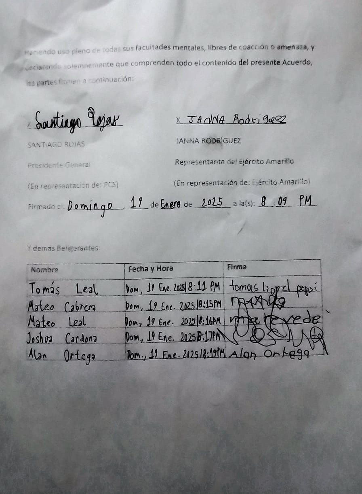

# The Santinian Times _(19 de enero de 2025)_

## Política

### Paz de Enero: Janna Rodríguez y compañía firman otra paz

Como se puede apreciar arriba, Janna Rodríguez, Tomás Leal, Mateo Cabrera, Mateo Leal, Joshua Cardona y Alan Ortega han firmado
hoy el Segundo Tratado de Paz de Los Robles, cuyo texto en formato PDF está disponible [aquí](./Segundo%20Tratado%20de%20Paz%20de%20Los%20Robles.pdf), asegurando así:

1. La paz: Ni el Partido Comunista ni los otros firmantes se atacarán, a menos que los firmantes vuelvan a intentar atacar al
   Estado santiniano o difamar a sus líderes.
2. El perdón: La propia [Batalla de Pablogrado](../../2024/04/times_04-27-2024.md) fue un crimen grave. Para mantener la paz, el 
   Partido ha perdonado a los golpistas y guerrilleros que intentaron erradicarlo. Ni los otros firmantes ni el Partido se
   insultarán o difamarán el uno a otro, aunque el [28 de abril](../../2024/04/times_04-28-2024.md) sigue siendo día patriótico.
3. El respeto: **Siempre y cuando los otros firmantes no ataquen al Partido**, el Partido no los atacará. Los otros firmantes
   se comprometen a no participar en actividades militares, subversivas o guerrilleras en el futuro.
4. Oferta de poder: Si ella quiere, Janna Rodríguez podrá entrar al Concejo Estatal de Los Robles para apoyar a Rojas en el
   liderazgo de la región. Sin embargo, _no es obligatorio_ y tiene que ceñirse al debido proceso de admisión del Partido.
5. Garantías: El gobierno federal de Santinia estará vigilando el cumplimiento adecuado del tratado, y los demás firmantes
   deben evitar cometer crímenes políticos. El acuerdo es legalmente vinculante y cualquier queja será resuelta directamente
   o, en su defecto, con la asistencia de la Liga Federal de Gobernadores.

Hemos alcanzado una paz roblense adicional, un alivio para las tensiones que han crecido desde el [Golpe de Diciembre](../../2024/12/times_12-10-2024.md) y otras infracciones al primer acuerdo firmado en abril, además de rumores e información recolectada por la
Oficina de Inteligencia de Santinia sobre un posible contraataque amarillo. 
