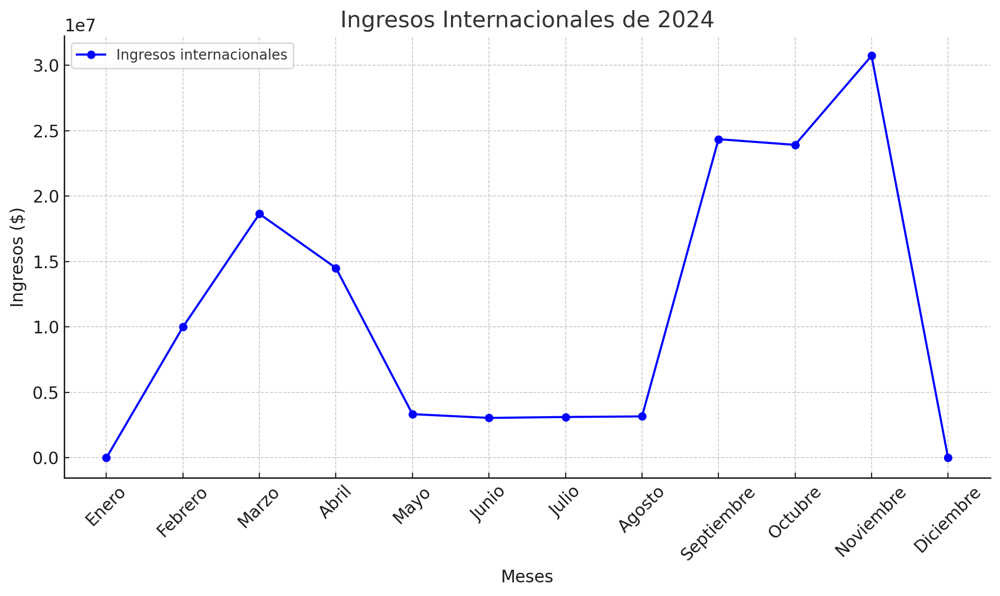

## Titulares

* [En el Día del Amor, la Unión Santiniana recibe ingresos masivos](/2025/02/times_02-14-2025.md#en-el-día-del-amor-la-unión-santiniana-recibe-ingresos-masivos)
* [Hoy se abre el comercio en la SAI, inicia el primer Plan Trimestral Estatal de 2025](/2025/02/times_02-05-2025.md#hoy-se-abre-el-comercio-en-la-sai-inicia-el-primer-plan-trimestral-estatal-de-2025)
* [Segundo Aniversario del Neosantinismo va bien, pero Manuel Garzón exige elecciones](/2025/02/times_02-01-2025.md#segundo-aniversario-del-neosantinismo-va-bien-pero-manuel-garzón-exige-elecciones)

## Resultados electorales

* [Elecciones Generales de Comité Central 2024](/2024/10/times_10-20-2024.md#resultados-de-las-elecciones-vicepresidente-general)

## Informes económicos

* [Enero-Junio 2024](/2024/06/times_06-17-2024.md#la-relación-con-oscarlandia-sigue-agridulce-fin-del-primer-plan-semestral)
* [Julio-Diciembre 2024](/2024/11/times_11-26-2024.md#la-relación-con-oscarlandia-es-excelente-fin-del-segundo-plan-semestral)

### Resumen gráfico de 2024

## Navega por nuestros artículos

* [Artículos de 2023](2023)
* [Artículos de 2024](2024)
* [Artículos de 2025](2025)
