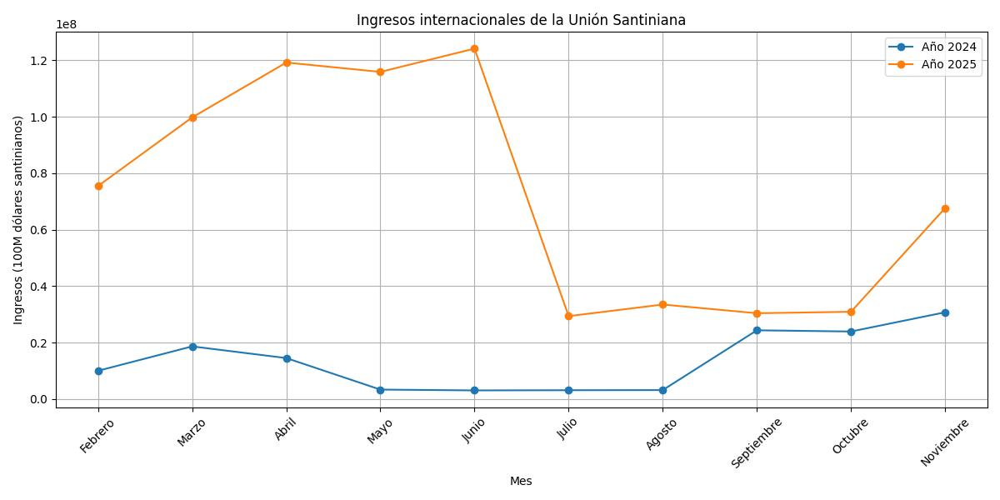

## Titulares

- [NOTICIAS DE ÚLTIMO MOMENTO: Rojas emite el Decreto 1 de 2026, nuevo Estado de Emergencia](/2026/06/20260609.md#noticias-de-último-momento-rojas-emite-el-decreto-1-de-2026-nuevo-estado-de-emergencia)
- [¡Insólito! Mateo Cabrera firma la Vicepresidencia, pero DECIDE NO ORGANIZAR UN EVENTO PÚBLICO](/2026/05/20260510.md#insólito-mateo-cabrera-firma-la-vicepresidencia-pero-decide-no-organizar-un-evento-público)
- [El Comité Central ha quedado constituido finalmente, sólo falta la formalización](/2026/04/20260429.md#el-comité-central-ha-quedado-constituido-finalmente-sólo-falta-la-formalización)
- [AVANCE: ¡Primer caso de corrupción en Santinia! Omar David Castillo, Primer Ministro, desterrado por el Tribunal Federal](/2026/03/20260324.md#avance-%C2%A1primer-caso-de-corrupci%C3%B3n-en-santinia-omar-david-castillo-primer-ministro-desterrado-por-el-tribunal-federal)

<!-- ESTOS TITULARES ESTÁN MÁS VIEJOS QUE YO...
* [En el Día del Amor, la Unión Santiniana recibe ingresos masivos](/2025/02/times_02-14-2025.md#en-el-día-del-amor-la-unión-santiniana-recibe-ingresos-masivos)
* [Hoy se abre el comercio en la SAI, inicia el primer Plan Trimestral Estatal de 2025](/2025/02/times_02-05-2025.md#hoy-se-abre-el-comercio-en-la-sai-inicia-el-primer-plan-trimestral-estatal-de-2025)
* [Segundo Aniversario del Neosantinismo va bien, pero Manuel Garzón exige elecciones](/2025/02/times_02-01-2025.md#segundo-aniversario-del-neosantinismo-va-bien-pero-manuel-garzón-exige-elecciones)
-->

## Navega por nuestros artículos

- [Artículos de 2023](2023)
- [Artículos de 2024](2024)
- [Artículos de 2025](2025)
- [Artículos de 2026](2026)

## Economía internacional

### Resumen gráfico

### Informes económicos

- [Enero-Junio 2024](/2024/06/times_06-17-2024.md#la-relación-con-oscarlandia-sigue-agridulce-fin-del-primer-plan-semestral)
- [Julio-Diciembre 2024](/2024/11/times_11-26-2024.md#la-relación-con-oscarlandia-es-excelente-fin-del-segundo-plan-semestral)
- [Enero-Junio 2025](/2025/06/times_06-14-2025.md#las-relaciones-con-oscarlandia-y-nuevos-aliados-van-viento-en-popa-inicia-el-segundo-plan-trimestral-estatal-de-2025)
- [Julio-Diciembre 2025](/2025/11/20251130.md#santinia-se-despidió-de-la-sai-fin-del-procedimiento-internacional-del-cuarto-plan-trimestral-estatal)

## Resultados electorales

- [Elecciones Generales de Comité Central 2024](/2024/10/times_10-20-2024.md#resultados-de-las-elecciones-vicepresidente-general)
