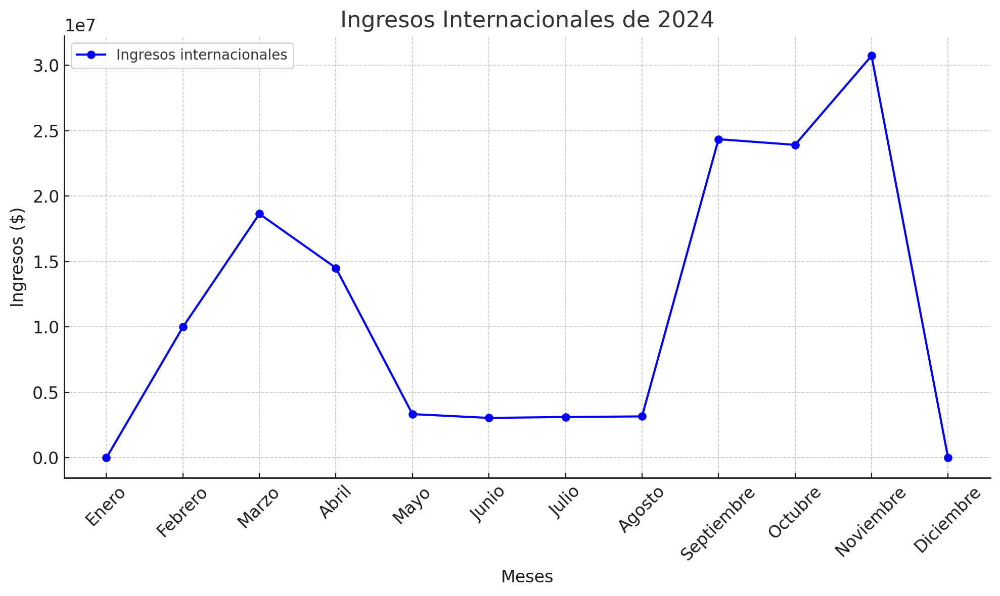

## Titulares

* [AVANCE: ¡Primer caso de corrupción en Santinia! Omar David Castillo, Primer Ministro, desterrado por el Tribunal Federal](20260324.md#avance-%C2%A1primer-caso-de-corrupci%C3%B3n-en-santinia-omar-david-castillo-primer-ministro-desterrado-por-el-tribunal-federal)
* [Gran Despedida de Rojas: Hoy se retira el camarada Rojas de la Presidencia; el cargo lo asumió Isabella Murillo Rojas](/2025/12/20251202.md#gran-despedida-de-rojas-hoy-se-retira-el-camarada-rojas-de-la-presidencia-el-cargo-lo-asumi%C3%B3-isabella-murillo-rojas)
* [Desde hoy, el "Santinian Times" se llamará "La Lucha"](/2026/03/20260322.md#desde-hoy-el-santinian-times-se-llamar%C3%A1-la-lucha)
* [¡Insólito! La Ley de Regulación Homosexual y Bisexual ha sido DEROGADA POR UNANIMIDAD del Comité Central](20260206.md#%C2%A1ins%C3%B3lito-la-ley-de-regulaci%C3%B3n-homosexual-y-bisexual-ha-sido-derogada-por-unanimidad-del-comit%C3%A9-central)

<!-- ESTOS TITULARES ESTÁN MÁS VIEJOS QUE YO... 
* [En el Día del Amor, la Unión Santiniana recibe ingresos masivos](/2025/02/times_02-14-2025.md#en-el-día-del-amor-la-unión-santiniana-recibe-ingresos-masivos)
* [Hoy se abre el comercio en la SAI, inicia el primer Plan Trimestral Estatal de 2025](/2025/02/times_02-05-2025.md#hoy-se-abre-el-comercio-en-la-sai-inicia-el-primer-plan-trimestral-estatal-de-2025)
* [Segundo Aniversario del Neosantinismo va bien, pero Manuel Garzón exige elecciones](/2025/02/times_02-01-2025.md#segundo-aniversario-del-neosantinismo-va-bien-pero-manuel-garzón-exige-elecciones)
-->

## Resultados electorales

* [Elecciones Generales de Comité Central 2024](/2024/10/times_10-20-2024.md#resultados-de-las-elecciones-vicepresidente-general)

## Informes económicos

* [Enero-Junio 2024](/2024/06/times_06-17-2024.md#la-relación-con-oscarlandia-sigue-agridulce-fin-del-primer-plan-semestral)
* [Julio-Diciembre 2024](/2024/11/times_11-26-2024.md#la-relación-con-oscarlandia-es-excelente-fin-del-segundo-plan-semestral)
* [Enero-Junio 2025](/2025/06/times_06-14-2025.md#las-relaciones-con-oscarlandia-y-nuevos-aliados-van-viento-en-popa-inicia-el-segundo-plan-trimestral-estatal-de-2025)
* [Julio-Diciembre 2025](/2025/11/20251130.md#santinia-se-despidió-de-la-sai-fin-del-procedimiento-internacional-del-cuarto-plan-trimestral-estatal)

### Resumen gráfico de 2024

## Navega por nuestros artículos

* [Artículos de 2023](2023)
* [Artículos de 2024](2024)
* [Artículos de 2025](2025)
* [Artículos de 2026](2026)
